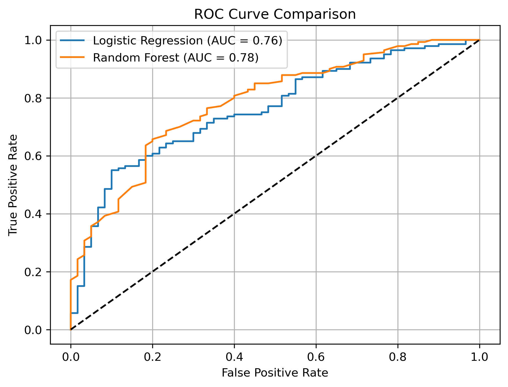
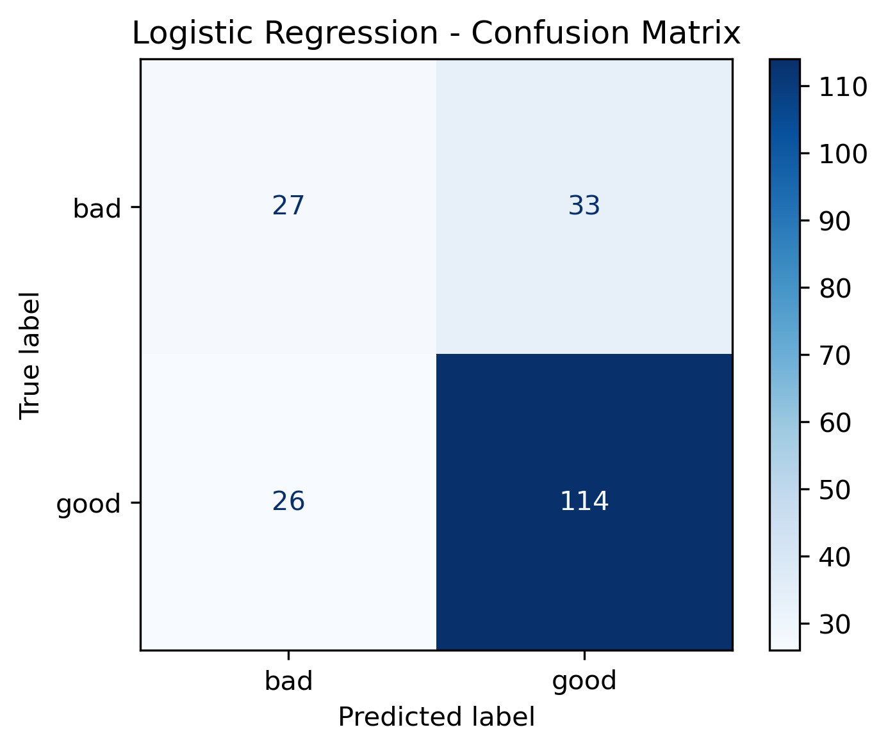
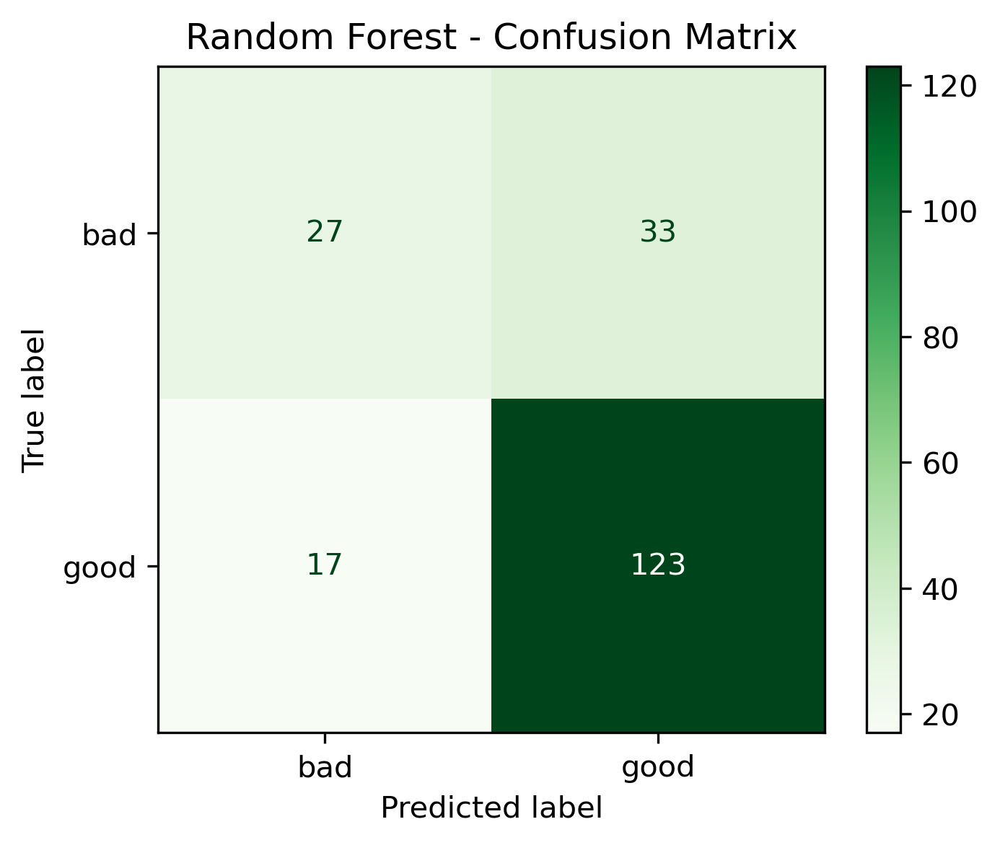
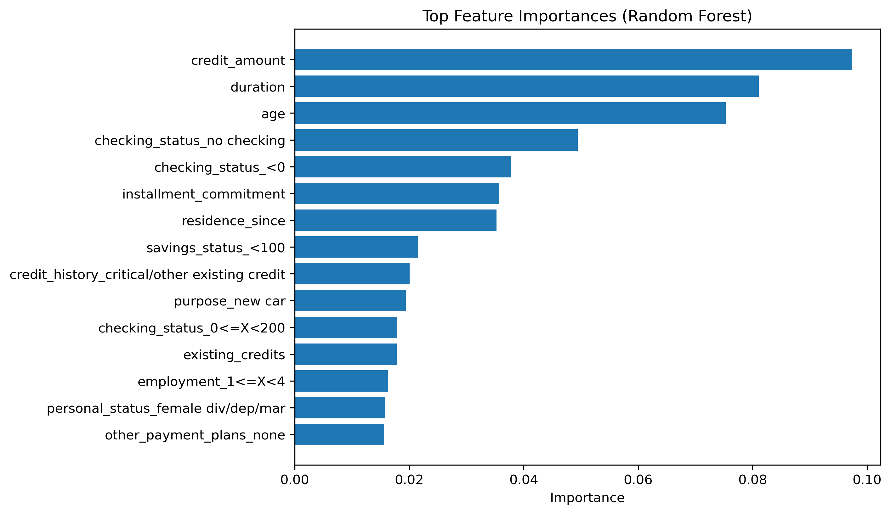

# Credit Risk Prediction using Machine Learning

## 📌 Overview

This project implements an end-to-end machine learning pipeline for credit risk prediction using structured financial data. The objective is to classify applicants as **good** or **bad** credit risk, supporting decision-making in financial systems.

The project demonstrates data preprocessing, model training, evaluation, and interpretability using industry-standard tools.

---

## 🎯 Objectives

- Build a complete machine learning pipeline  
- Compare interpretable and nonlinear models  
- Evaluate model performance using multiple metrics  
- Analyze feature importance  

---

## 📊 Dataset

- **Source:** OpenML German Credit Dataset  
- **Samples:** 1000  
- **Features:** 20  
- **Target Classes:**
  - Good credit: 700  
  - Bad credit: 300  

The dataset contains both numerical and categorical variables such as age, credit amount, employment status, and credit history.

---

## ⚙️ Methodology

### 🔹 Preprocessing Pipeline
- Numerical features:
  - Median imputation  
  - Standard scaling  
- Categorical features:
  - Most frequent imputation  
  - One-hot encoding  

Implemented using `ColumnTransformer` from scikit-learn.

---

### 🔹 Models

#### Logistic Regression
- Linear baseline model  
- High interpretability  
- Suitable for regulated environments  

#### Random Forest
- Ensemble model of decision trees  
- Captures nonlinear relationships  
- Provides feature importance  

---

## 📈 Results

### ROC Curve



---

### Confusion Matrices

| Logistic Regression | Random Forest |
|--------------------|--------------|
|  |  |

---

### Feature Importance (Random Forest)



---

## 🧠 Key Findings

- Random Forest achieves higher predictive performance  
- Logistic Regression offers better interpretability  
- Feature importance highlights key financial indicators  
- A structured pipeline ensures reproducibility  

---

## 💾 Reproducibility

### Requirements

```bash
pip install -r requirements.txt
